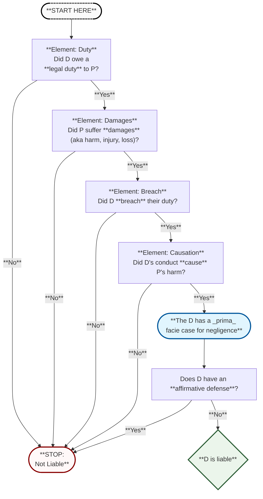
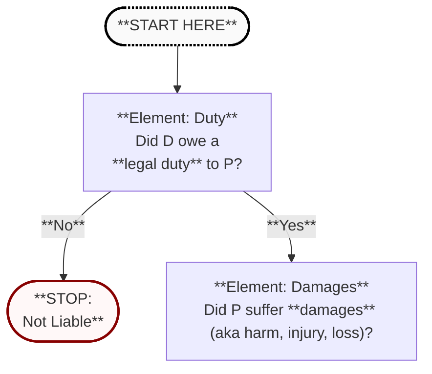
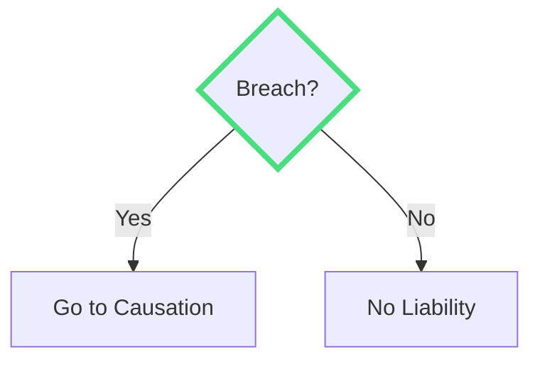
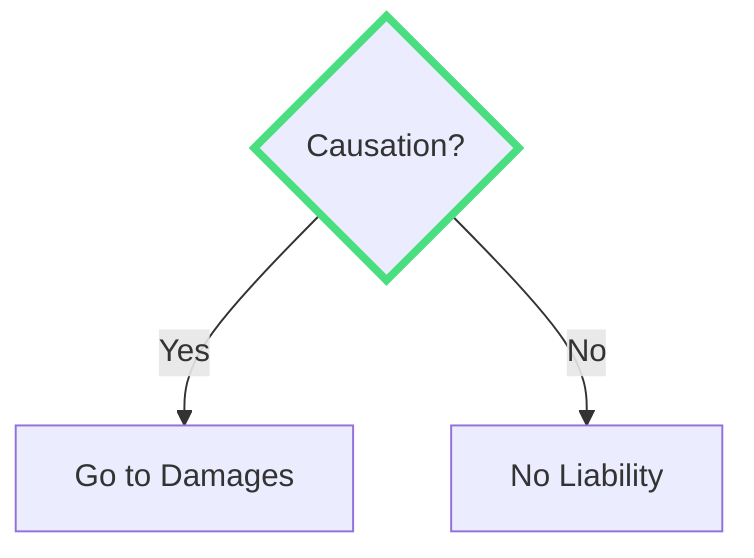
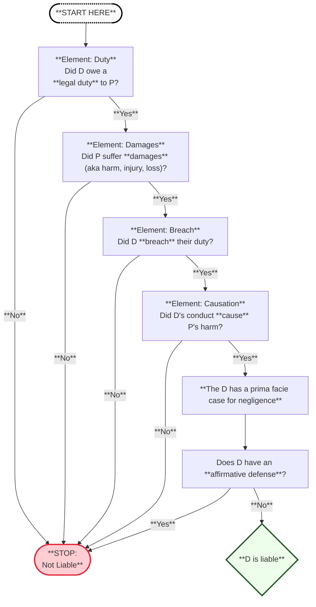

# Negligence & Products Liability

---
class: -mt-8
alias: overview
---

## Overview: Negligence in General

<v-clicks>

1. **_Prima Facie_ Case for Liability**  
   > **Note:** "*prima facie* case" means:  
   > **(a)** P has alleged sufficient evidence to support a claim at **face value**, and  
   > **(b)** P's evidence is rebuttable by defenses.

   - **Duty** (to others)
   - **Breach** (of duty)
   - **Damages** (suffered by another)
   - **Causation** (of damages)

2. **Defenses to Liability**
   - Failure of Proof
   - Affirmative Defenses

</v-clicks>

---
class: -mt-5
alias: overview_flowchart
---

### Overview Flowchart
 

---

### When is there a duty?

<v-clicks>

1. **_Prima Facie_ Case for Liability**  
   > **Note:** "*prima facie* case" means:  
   > **(a)** P has alleged sufficient evidence to support a claim at **face value**, and  
   > **(b)** P's evidence is rebuttable by defenses.

   - **Duty** (to others)
   - **Breach** (of duty)
   - **Damages** (suffered by another)
   - **Causation** (of damages)

2. **Defenses to Liability**
   - Failure of Proof
   - Affirmative Defenses

</v-clicks>

---

# When is there a duty?

---
---
# When is there a duty?

---
alias: overview_map
zoom: 1.3
---

x

---
alias: placeholder
---
# Element 1: Duty
Did D have a duty to P?

what's up?

---
class: text-center
alias: not_liable
---

# Outcome

D is not liable for negligence.

---
alias: breach
decision: true
question: "Breach?"
yesTarget: causation
noTarget: not_liable
---

# Element 2: Breach
Did D breach the duty to P?

---
alias: causation
decision: true
question: "Causation?"
yesTarget: breach
noTarget: damages
---

# Element 3: Causation
Did the defendant's breach cause harm?

---
alias: damages
decision: true
question: "Causation?"
yesTarget: 4
noTarget: 7
dragPos:
  square: -109,0,0,0
---

